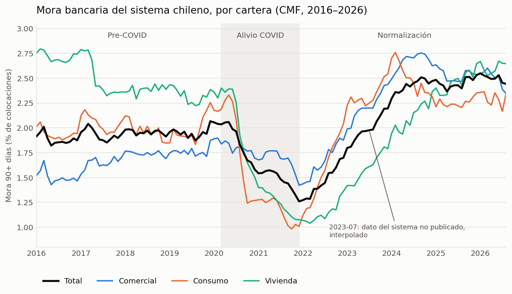
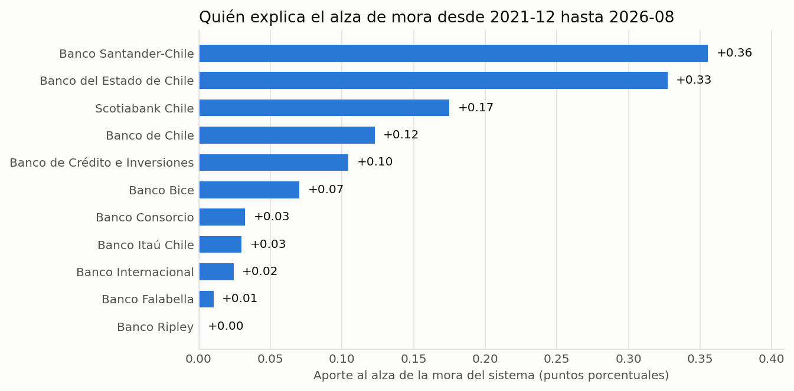
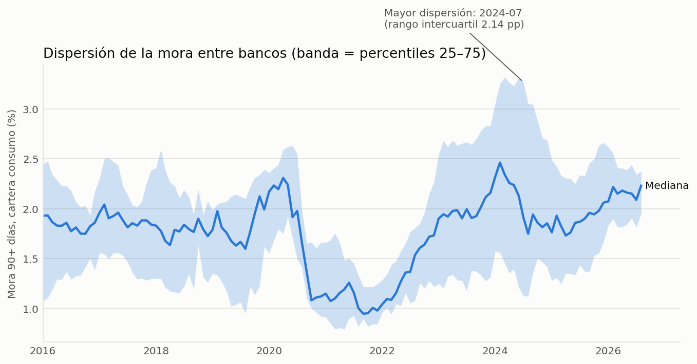
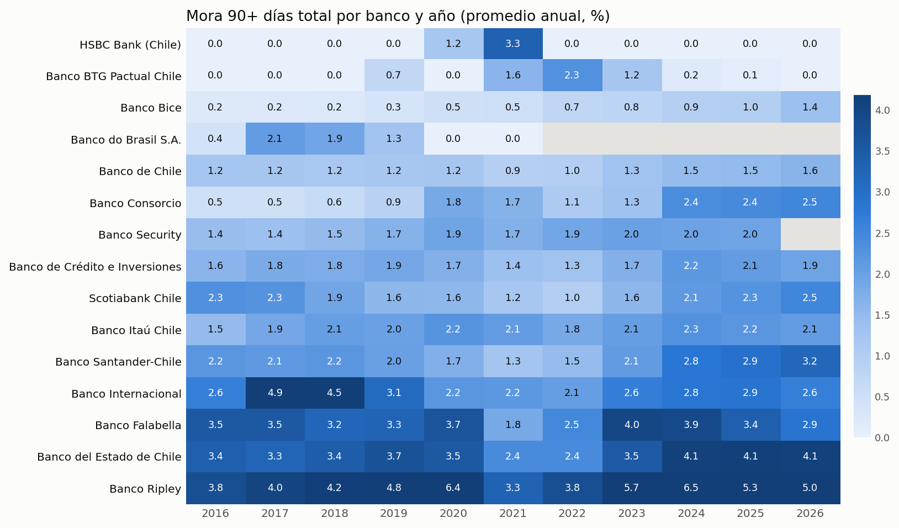
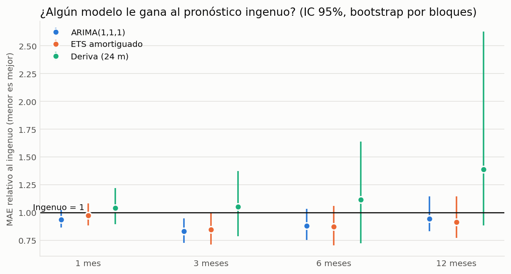
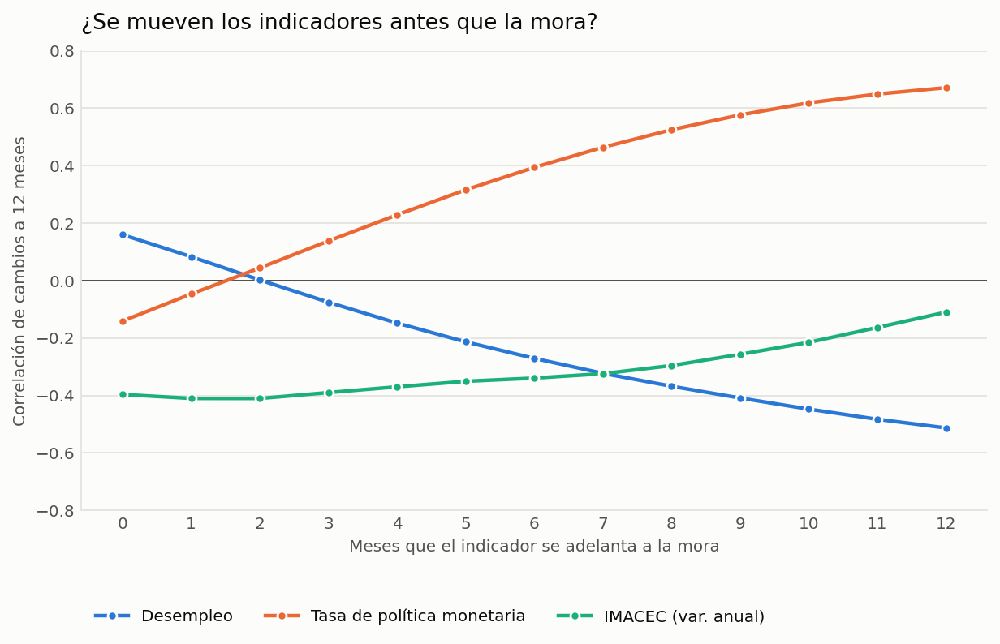
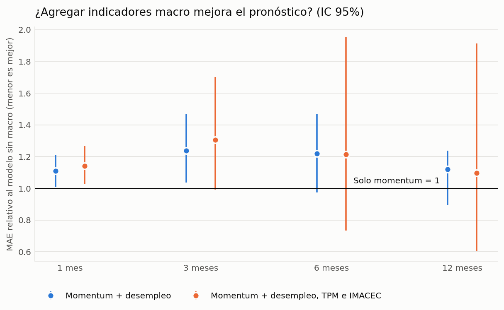
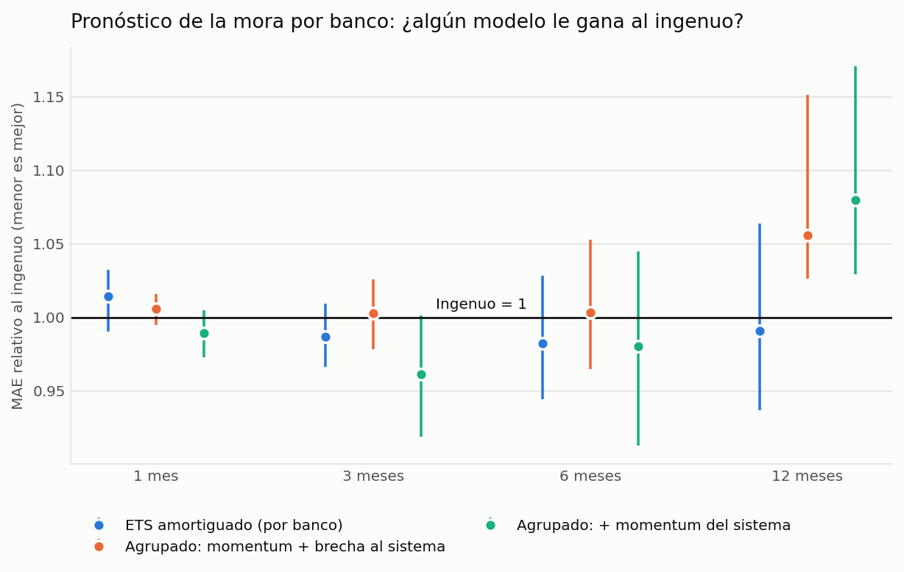
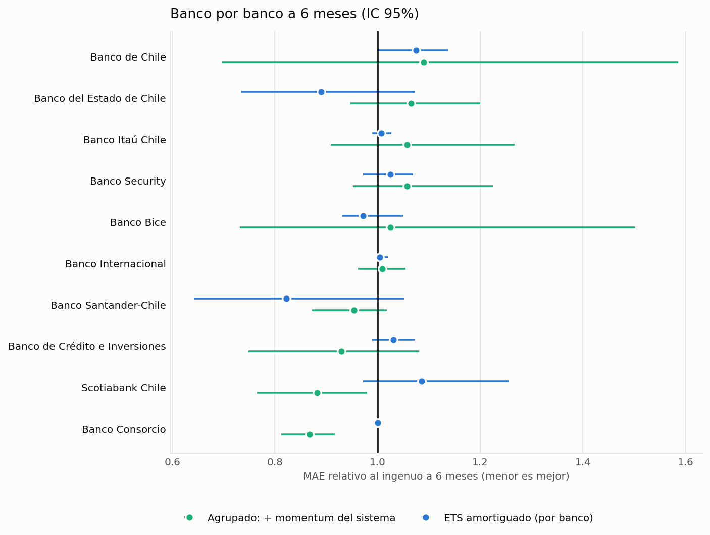

# Chilean bank delinquency, 2016–2026 — a monthly panel from the CMF

[Versión en español](README.es.md) · English




## Why this project

Bank delinquency is the first number anyone asks for when they want to know whether Chilean credit is getting worse, and the CMF publishes it every month. But it is published as **128 separate Excel files**, one per month, in **three different layouts**. I wanted to turn that into one clean panel and answer five questions an analyst actually gets asked:

1. How big was the COVID-era drop in arrears, and how much of it has come back?
2. Is the recent rise a *system-wide* deterioration, or is it a few banks, or a shift in who lends?
3. Can a simple model forecast next quarter's delinquency better than "same as today"?
4. Do macro indicators (unemployment, the policy rate, IMACEC) improve those forecasts?
5. Can an individual bank's delinquency be forecast, by borrowing strength across banks?

Everything runs from one command and every number below comes from that run.

## Data

Source: [CMF Chile — *Indicador de morosidad de 90 días o más individual del Sistema Bancario*](https://www.cmfchile.cl/portal/estadisticas/626/w4-propertyvalue-28914.html). Public, no API key.

| | |
|---|---|
| Months | 128 (2016-01 → 2026-08) |
| Rows | 2,453 (bank × month) |
| Entities | 24 banks + the official "Sistema Bancario" row |
| Measure | % of loans 90+ days past due, for total, commercial, personas, consumo and vivienda; plus the arrears amount in MM$ |

The small tidy panel is committed at [`data/panel_mora90.csv`](data/panel_mora90.csv) so tests and `--offline` runs need no network. Raw `.xlsx` files are downloaded on demand and not versioned.

**Macro indicators (finding 5).** Monthly unemployment, policy rate (TPM) and IMACEC from [mindicador.cl](https://mindicador.cl), an open API that mirrors Banco Central and INE series. It is a third-party aggregator, not the official publisher, so figures can differ from the official ones or be revised later; I use the values as they stood when I downloaded them (2026-10-03), not real-time vintages. The small table is committed at [`data/macro_indicators.csv`](data/macro_indicators.csv). CPI is left out because the API only returns it up to 2025-12.

### Things the files do that a naive reader would get wrong

- **Three layouts.** 2016-01–2021-12 (9 columns, bank name in column A), 2022-01–2023-03 (12 columns, no text headers on the % block), 2023-04 onwards (12 columns with headers). The parser detects the layout and **refuses to guess**: if the expected headers are not where they should be it raises.
- **No break at the 2022 change.** The system total goes 1.259% → 1.273% from 2021-12 to 2022-01, so the layout change is not a definition change (there is a test for it).
- **`---` is not zero.** It means the bank has no such portfolio. It is kept as `NaN`.
- **Mergers and renames.** `Itaú Corpbanca` became `Banco Itaú Chile`; `BBVA Chile` became `Scotiabank Azul`; `Jp Morgan…`/`JP Morgan…` differ only by case. The *old* `Banco Itaú Chile` of 2016-01…03 is a different, pre-merger entity and is excluded from the continuous series.
- **A real hole in the source.** In the 2023-07 file the CMF left the "Sistema Bancario" row as `---` although all 18 banks are present. That single month is interpolated linearly and flagged (`imputed`); a gap longer than one month raises instead of being invented.

## Findings

### 1. The COVID relief was large and has fully reversed

| Regime | System total (mean) | Comercial | Consumo | Vivienda |
|---|---|---|---|---|
| Pre-COVID (2016-01 → 2020-02) | 1.94% | 1.67% | 1.99% | 2.48% |
| COVID relief (2020-03 → 2021-12) | 1.65% | 1.73% | 1.46% | 1.60% |
| Normalisation (2022-01 →) | 2.14% | 2.30% | 2.18% | 1.94% |

System delinquency was **2.04% in Feb 2020**, fell to a minimum of **1.26% in Dec 2021** (−0.78 pp) and is **2.44% in Aug 2026**: a rebound of **+1.18 pp**, ending **0.40 pp above where it started**. The portfolios did not move together. Household credit swung far more than commercial credit:

| Portfolio | Feb 2020 | Minimum | Aug 2026 | Fall to minimum | Rebound since |
|---|---|---|---|---|---|
| Commercial | 1.90% | 1.42% (2021-12) | 2.34% | −0.47 pp | +0.92 pp |
| Consumo | 2.17% | 0.98% (2021-10) | 2.35% | −1.18 pp | +1.36 pp |
| Vivienda | 2.30% | 1.04% (2022-03) | 2.65% | −1.26 pp | +1.61 pp |

Mortgage arrears are now the furthest above their pre-COVID level among the household portfolios (+0.35 pp, against +0.18 pp for consumo), and commercial arrears show the largest gap against Feb 2020 of the three (+0.45 pp), even though they swung the least.

### 2. The rise since the trough is deterioration inside banks, not a change in who lends

Decomposing the +1.25 pp change between Dec 2021 and Aug 2026 into *within-bank* change and *mix* change (Kitagawa, on the 11 banks present at both dates, covering 96–99.7% of loans):

| Component | pp |
|---|---|
| Within-bank deterioration | **+1.27** |
| Mix (shifts in bank market share) | −0.02 |
| Total | +1.25 |

Three banks explain about two thirds of it: **Santander-Chile (+0.36 pp), Banco del Estado (+0.33 pp) and Scotiabank Chile (+0.17 pp)**.



### 3. Banks converge in a crisis and diverge in a recovery

The spread between banks in consumer arrears (interquartile range) peaked at **2.14 pp in July 2024** and is **0.42 pp** now. The *ranking* of banks is moderately persistent: the Spearman rank correlation of consumer arrears between Dec 2019 and Aug 2026 is **0.69**.





### 4. Beating "same as today" is hard, and the evidence is thin

Rolling-origin backtest of the system total (first forecast after 60 months of history, 68 origins at the 1-month horizon). Metric: MAE relative to the naive forecast (1.0 = same as naive), with a 95% block-bootstrap interval.

| Horizon | ARIMA(1,1,1) | ETS damped | 24-month drift |
|---|---|---|---|
| 1 month | 0.94 [0.87, 1.02] | 0.98 [0.88, 1.08] | 1.04 [0.90, 1.22] |
| 3 months | **0.83 [0.73, 0.95]** | 0.85 [0.71, 1.00] | 1.05 [0.79, 1.37] |
| 6 months | 0.88 [0.75, 1.03] | 0.87 [0.70, 1.06] | 1.12 [0.72, 1.64] |
| 12 months | 0.94 [0.83, 1.14] | 0.91 [0.77, 1.15] | 1.39 [0.89, 2.63] |

**Only ARIMA at 3 months has an interval that excludes 1.** Everywhere else I cannot show an edge over the naive forecast, and extrapolating the recent trend (drift) is *worse* at long horizons. A seasonal-naive forecast is far worse (rMAE 8.4 at 1 month): arrears have no stable seasonality.



### 5. Macro indicators do not improve the forecast

I tested three monthly indicators: unemployment, the policy rate and IMACEC (annual change). Unemployment and IMACEC are lagged one month for publication, so a forecast only uses what was known at its origin.

**They do move before arrears, with signs that need care.** Correlation between the 12-month change in arrears and the 12-month change in each indicator, with the indicator leading by *k* months (116 overlapping observations):

| Indicator | Same month | Leading by 6 months | Leading by 12 months |
|---|---|---|---|
| Policy rate (TPM) | −0.14 | +0.39 | **+0.67** |
| Unemployment | +0.16 | −0.27 | **−0.51** |
| IMACEC (annual change) | −0.40 | −0.34 | −0.11 |



- The policy rate, a year earlier, correlates strongly with the rise in arrears: consistent with rate rises passing through to borrowers, which I did not test as a causal claim.
- Unemployment has the *wrong* sign at long leads. Unemployment rose sharply in 2020 while arrears fell, because of the relief measures, and that episode dominates a sample this short.
- These are changes over overlapping 12-month windows, so neighbouring correlations are not independent and I give no p-values. It is a description, not a test.

**But adding them makes the forecasts worse.** Direct forecasts at each horizon (least squares of the future change on today's features), with the same expanding-origin protocol as finding 4 (68 origins at one month). The reference is the same model without macro, so the table isolates what the indicators add. Below 1 means better.

| Horizon | Momentum only, vs naive | + unemployment, vs momentum only | + unemployment, TPM and IMACEC, vs momentum only |
|---|---|---|---|
| 1 month | 0.95 [0.87, 1.06] | 1.11 [1.01, 1.21] | 1.14 [1.03, 1.27] |
| 3 months | **0.82 [0.70, 0.97]** | 1.24 [1.04, 1.47] | 1.30 [0.99, 1.70] |
| 6 months | 0.98 [0.80, 1.13] | 1.22 [0.97, 1.47] | 1.21 [0.73, 1.95] |
| 12 months | 1.13 [1.02, 1.28] | 1.12 [0.89, 1.24] | 1.10 [0.61, 1.91] |



- Adding macro raises the error by 10 to 30% relative to momentum alone. At 1 and 3 months for unemployment, and at 1 month for all three, the interval excludes 1: it is worse, not just no better. Elsewhere the intervals include 1.
- Momentum alone (the change over the last three months) beats the naive forecast only at 3 months (0.82, about the same as the ARIMA of finding 4) and is *worse* than naive at 12 months.
- **I did not test why macro hurts.** A plausible cause is that in the training windows the COVID relief reversed the usual link between unemployment and arrears, so the coefficients learned there mislead afterwards; the unemployment row of the correlation table is the symptom. With 60 to 120 months, three extra regressors can also simply overfit.

### 6. Individual banks are close to a random walk

Forecasting one bank's arrears is harder than forecasting the system: each series is short and noisy. A natural idea is to borrow strength across banks with a single pooled regression whose features include the bank's **gap to the system** (does a bank far above the system drift back toward it?) and the system's own momentum. I tested it on the 10 banks with at least 100 months of data and a median share of at least 1% of system loans. The rest are foreign branches and small banks whose arrears jump from 0% to 4% on a single loan and would dominate any average error.

Same protocol as finding 4 (68 origins at one month). The table gives the mean absolute error across banks relative to the naive forecast, with a block bootstrap that resamples by month (banks in the same month share the month's shock, so resampling banks one by one would understate the uncertainty). Below 1 is better.

| Horizon | Naive error (pp) | ETS per bank | Pooled: momentum + gap | Pooled: also system momentum |
|---|---|---|---|---|
| 1 month | 0.09 | 1.01 [0.99, 1.03] | 1.01 [0.99, 1.02] | 0.99 [0.97, 1.00] |
| 3 months | 0.16 | 0.99 [0.97, 1.01] | 1.00 [0.98, 1.03] | **0.96 [0.92, 1.00]** |
| 6 months | 0.24 | 0.98 [0.94, 1.03] | 1.00 [0.97, 1.05] | 0.98 [0.91, 1.04] |
| 12 months | 0.33 | 0.99 [0.94, 1.06] | 1.06 [1.03, 1.15] | 1.08 [1.03, 1.17] |



- **No model clearly beats "same as today" at any horizon.** The closest is the pooled model with the system's momentum at 3 months (0.96), whose interval touches 1.00.
- **The gap to the system adds nothing.** Comparing the pooled model with the gap against the same model without it gives 1.00 at every horizon up to 6 months (intervals within 0.98 to 1.02): no evidence of mean reversion toward the system level in this sample. I checked that the method can see it when it exists: on synthetic banks built with a 15% monthly reversion it cuts the error by 13% (0.87 [0.81, 0.94]), and with no reversion it does not (1.04 [1.01, 1.08]).
- **At 12 months the pooled models are worse** than naive (1.06 and 1.08, intervals above 1).
- **ETS is almost identical to naive** because a damped trend on these smooth series stays nearly flat.



Bank by bank at 6 months, two intervals for the pooled model exclude 1: Banco Consorcio (0.87 [0.81, 0.92]) and Scotiabank Chile (0.88 [0.77, 0.98]). With 20 intervals (10 banks, 2 models), one or two falling outside by chance is expected, so I do not read them as banks that are predictable.

Limits: total arrears only, 10 banks, no correction for multiple comparisons, and the errors are small in absolute terms (0.09 to 0.33 pp), so an edge of 2 to 4% is a few hundredths of a percentage point.

## Limitations

- **Arrears are not losses.** 90+ day delinquency says nothing about recoveries, provisions or write-offs.
- **The attribution in finding 2 is accounting, not causality.** It says *where* the rise happened. It does not say why. The relief measures of 2020–21 are context I did not test.
- **Loan balances are implied, not published.** The CMF gives arrears in % and in MM$, not the loan stock, so I back it out as `MM$ / (% / 100)`. It is only defined where arrears are positive, so banks at 0% drop out of the weights. This is why the reconstructed system figure in the decomposition (2.49%) sits slightly above the official one (2.44%).
- **Small backtest.** 56–68 overlapping origins on one regime-shifting series. The intervals are wide and the evaluation window starts in 2021, so it mostly measures the post-COVID rebound.
- **Entity histories are not fully comparable.** Names change in the source (Itaú Corpbanca → Banco Itaú Chile, BBVA Chile → Scotiabank Azul), the BBVA/Scotiabank Azul series ends in 2018-08 and Banco Security is no longer reported after 2025-10. I handle the renames I could identify in the files; I did not research the corporate transactions behind them.
- **Macro data are not real-time vintages.** They come from a third-party aggregator and are the values available on the download date; later revisions would not be visible. The one-month publication lag I apply to unemployment and IMACEC is an assumption I did not check against the official calendars, and I only tried linear models.
- **The per-bank study covers 10 banks** chosen by data length and size, not all 24 entities, and it compares many intervals without correcting for it. A bank that looks predictable at one horizon is most likely noise.

## Run it

```bash
python -m venv .venv && source .venv/bin/activate   # Windows: .venv\Scripts\activate
pip install -r requirements.txt
export PYTHONPATH=src                                # Windows PowerShell: $env:PYTHONPATH="src"

python -m cmf_delinquency.pipeline --offline         # uses the committed panel, ~30 s
python -m cmf_delinquency.pipeline                   # downloads the 128 files and the macro series first
pytest                                               # 77 tests, no network
```

Outputs: `reports/results.json`, `reports/tables/*.csv`, `reports/figures/*.png`.

## Layout

```
src/cmf_delinquency/
  download.py   scrape the index page, fetch the monthly .xlsx (idempotent)
  parse.py      three layouts -> one tidy panel, name aliases, mergers
  analysis.py   regimes, within/mix decomposition, dispersion, rank persistence
  macro.py      open macro indicators (mindicador.cl) and publication lags
  banks.py      per-bank forecasts: pooled models across banks, bank selection
  forecast.py   rolling-origin backtest, block-bootstrap intervals
  plots.py      figures
  pipeline.py   end to end
tests/          77 tests: synthetic files in both layouts + integrity checks on the real panel + macro, per-bank and no-look-ahead checks
```

## License

MIT. The underlying data belongs to the Comisión para el Mercado Financiero (CMF).
